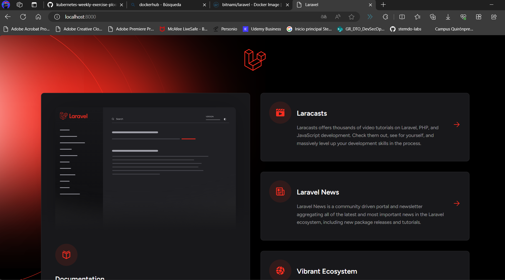
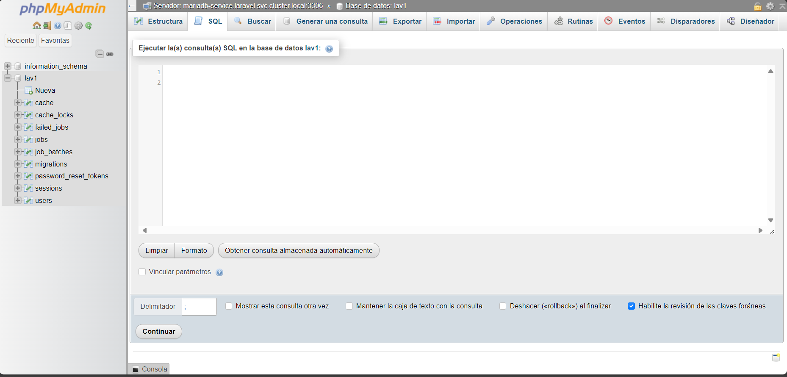
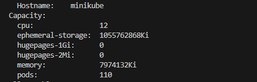

1. Crear un Namespace
   Primero, creamos un namespace llamado "laravel".

2. Crear un Deployment para Laravel

3. Crear un Service para Laravel

4. Crear deployment para la base de datos 

5. Crear un service para la base de datos 

6. Configurar la aplicación Laravel para que se conecte a la base de datos

----
7. Crear el nuevo namespace phpmyadmin

8. Crea el deployment de phpmyadmin

9. Crear el service de phpmyadmin

10. Crear el secrets de phpmyadmin

11. Lanzarlo :
    

12. Viendo las capacidades del pc :
    
    Podemos saber cuanto asignarle a cada namespace

13. Creamos los ficheros de limites tanto para un namespace como para el otro

